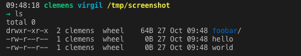

# ckaserer's dotfiles

My configuration. Minimalist, but helps save a few thousand keystrokes a day. I use macOS, so I can only guarantee they'll work on a Mac, but I use some of these dotfiles on various linux servers, and they seem to be pretty flexible.

You may also be interested in my [Mac Development Ansible Playbook](https://github.com/ckaserer/mac-dev-playbook), which configures a Mac from scratch using Ansible, and incorporates the installation and updating of a set of dotfiles like this one.


----

## .bashrc

If you work most of the time on the CLI, like I do, you might want to add a bit of color to your life. With this customized bashrc you get a bash prompt streched over 2 line so you can easily see the user, host, path and git branch if you are in a git repository at a glance. In addition `ls` and `grep` are colorized if your system supports it.

<p align="center">

</p>

<br>

<p align="center">

</p>


### Let's bring color and git support to your bash!

First we clone the repository to your machine via

```
git clone https://github.com/ckaserer/dotfiles.git
```

Next we need to configure your `~/.bashrc` to source the content of the `bashrc` file from the repo. We can do that by adding the following line to the end of your `~/.bashrc`.

```
if [ -f /path/to/dotfiles/bashrc ]; then . /path/to/dotfiles/bashrc; fi
```

What did we do just now?! We added a line to your bashrc which sources the `/path/to/dotfiles/bashrc` file if the file exists.

It won't work right away since your `~/.bashrc` is only read when you open a new shell. We can open a new shell by typing 

```
bash
``` 

or source the `/path/to/dotfiles/bashrc` file manually in the current shell by executing

```
. /path/to/dotfiles/bashrc
```

---

## License

MIT / BSD
